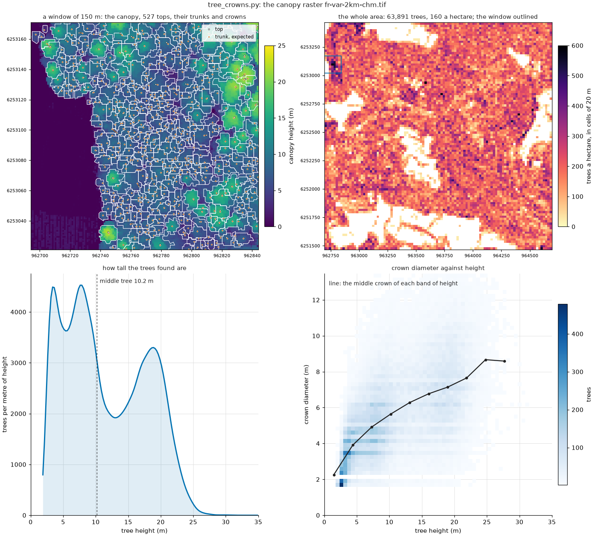
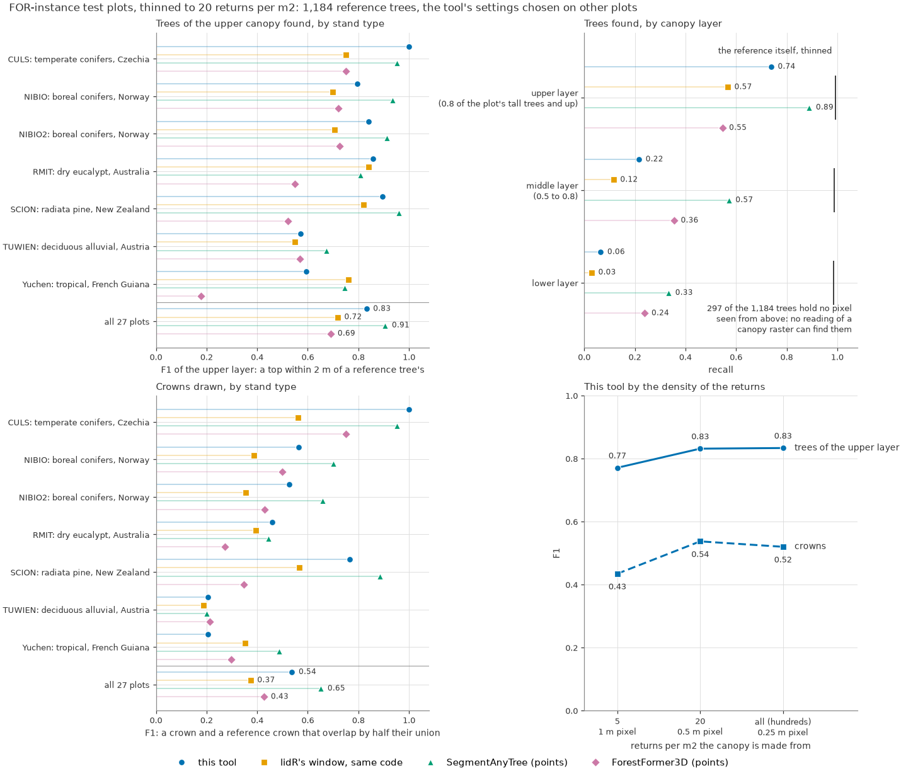
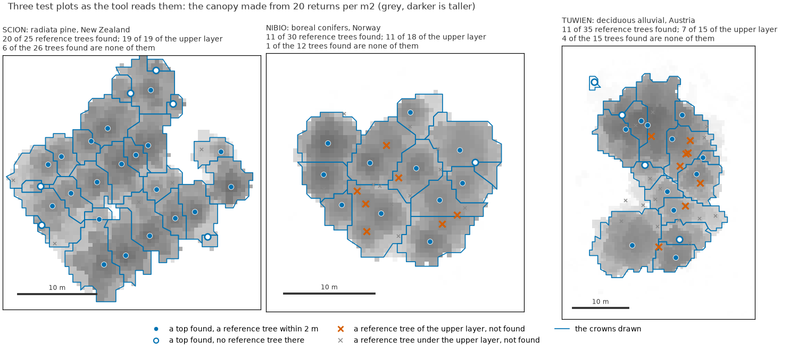
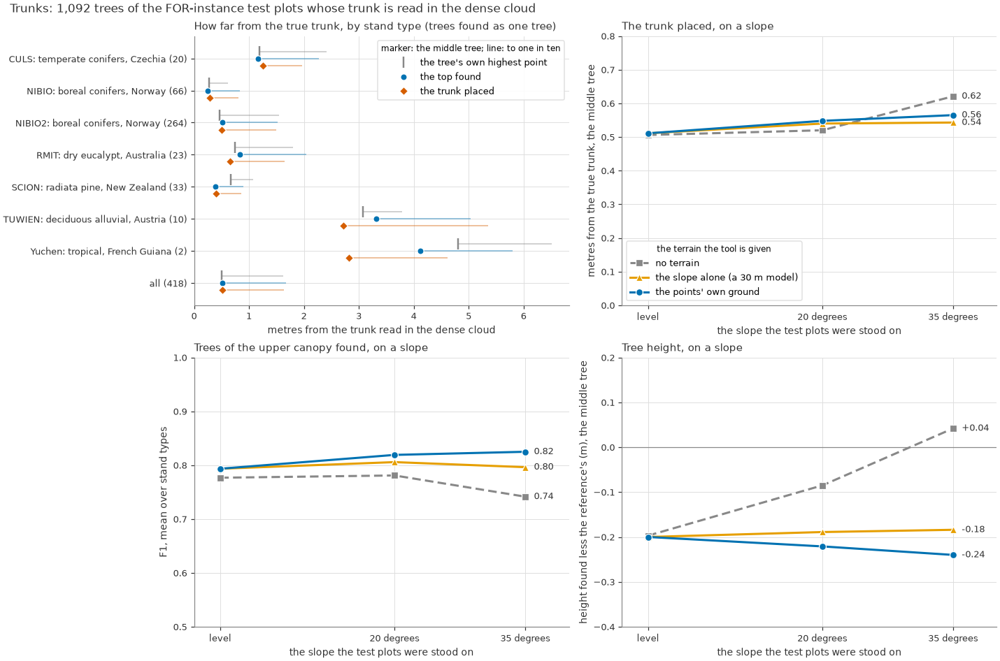
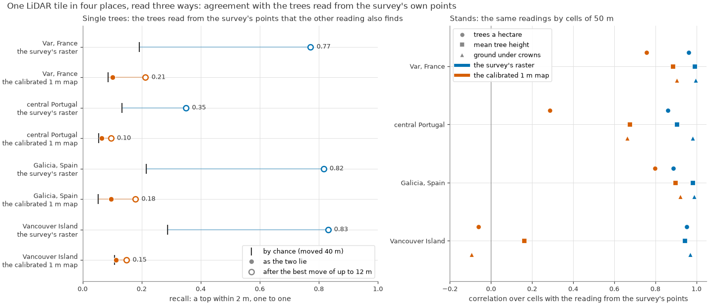
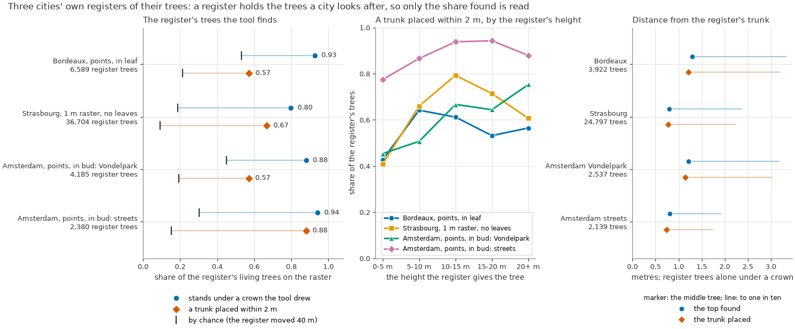

# Tree crowns

`crowns` writes a top, an expected trunk, and a crown polygon for each tree it finds in a canopy-height raster or an airborne LiDAR point cloud (LAS/LAZ).

```
pixi run crowns --chm canopy.tif --out out/
pixi run crowns --points a.laz b.laz --out out/
pixi run crowns --chm canopy.tif --out out/ --dem none
pixi run crowns --chm canopy.tif --out out/ --validate trees.gpkg
```

From Python, in this directory:

```python
from tools.crowns import run, delineate, Rule

run(chm="canopy.tif", out="out/")
trees = delineate(height, pixel_m)   # metres above ground, NaN where empty
trees = delineate(height, pixel_m, Rule(min_height=3), terrain=ground)
```

`delineate` is one array in, one `Trees` record out. `run` reads the input, fetches a terrain when asked, and writes the files below.



## Outputs

| file | contents |
|---|---|
| `tree_tops.gpkg`, `tree_tops.geojson` | one point per tree, at the top |
| `tree_stems.gpkg`, `tree_stems.geojson` | one point per tree, where the trunk is expected |
| `tree_crowns.gpkg`, `tree_crowns.geojson` | one polygon per tree |
| `crown_ids.tif` | tree number per pixel, 0 outside a crown |
| `canopy_height.tif` | the canopy the trees were read from |
| `trees.qlr`, `*.qml` | QGIS. Drag the `.qlr` in |
| `report.json`, `report.png` | counts and the figure |
| `README.md` | files, fields, and what this run found |
| `validation.json` | with `--validate` |

GeoPackage keeps the input CRS. GeoJSON is WGS 84 to a centimetre. `--format gpkg` or `--format geojson` writes one of them. `tree_id` joins the vector files and is the value in `crown_ids.tif`.

| field | unit | holds |
|---|---|---|
| `tree_id` | | tree number, the same in every file |
| `height_m` | m | canopy height at the top; with a terrain, top elevation minus ground under the trunk |
| `crown_area_m2` | m2 | crown area, from the pixels |
| `crown_diameter_m` | m | diameter of a circle of that area |
| `crown_mean_height_m` | m | mean canopy height over the crown |
| `prominence_m` | m | height of the top above the highest pass to taller canopy |
| `at_edge` | | 1 if the crown touches the data edge or a hole |
| `top_x`, `top_y` | | top, in the file CRS |
| `stem_x`, `stem_y` | | expected trunk |
| `ground_m` | m | terrain under the trunk; empty without a terrain |
| `slope_deg` | deg | slope there; empty without a terrain |

## Method

Lengths are metres on the ground. A raster in degrees, feet, or web mercator is warped to the UTM zone of its centre first, at its own ground resolution.

1. **Points** (`--points`). Highest return in each pixel. Each return is spread over 0.2 m so a pulse through the crown does not leave a one-cell pit. Ground is a plane through the nearest class-2 returns, a `--dem` raster, or nothing with `--normalised`. Buildings, noise, water, wires, and bridges are dropped. The pixel is 0.25 m from 40 first returns per m2, 0.5 m from 6, and 1 m below that (`--pixel` overrides).
2. **Tops.** Gaussian smooth of 0.5 m (`--smooth`). Every pixel of canopy (`--min-height`, 2 m) walks up its steepest rise. A high point is a top when it is the highest pixel of a round window `--window` wide (default 1 m plus 3.5% of its height; Popescu & Wynne 2004), and never smaller than 3 pixels.
3. **Prominence** (`--stands M SHARE`, off by default). The top must also stand M metres, or SHARE of its height, above the highest pass that leads to taller canopy. `prominence_m` is written either way.
4. **Crowns.** `watershed` (default) gives each pixel to the top its rise leads to, and joins a high point that is not a top to the neighbour it meets at its highest pass. Pixels below `--floor` (0.5) of the tree height are dropped. `dalponte` grows each crown out from its top (Dalponte & Coomes 2016, the lidR thresholds). `silva` gives each pixel to the nearest top within limits (Silva et al. 2016, the lidR thresholds). lidR's 10-pixel reach is 10 m here.
5. **One piece.** The crown is the component that holds its top. A hole of up to 4 m2 is filled. A crown under `--min-area` (2 m2) is dropped.
6. **Terrain** (`--dem`). Canopy height is above the ground under each pixel, so on a slope the downhill side reads tall and the highest pixel sits downhill of the tree (Khosravipour et al. 2015). With a terrain, the crown is put back on that ground, smoothed the same way as the canopy, and the top is the highest pixel of the sum. `height_m` is the top's elevation minus the ground under the trunk. Slope is the terrain over 2 m around the trunk. `auto` uses the points' own ground. For a raster, or for heights already above ground, it reads GEDTM30 and Copernicus DEM GLO-30 (both 30 m, no account) and takes their mean. `none` leaves the canopy raster as it is. A file path uses that raster. `--dem-dir` reads the two models from a folder or a mirror.
7. **Trunk.** Not measured. Placed under the weighted middle of the upper `--stem-share` (0.15) of the crown. A point that falls outside its crown is put under the top.
8. **Outline.** `simplified` (default) takes out steps of up to 0.75 of a pixel, keeps a shared boundary as one line, and keeps the area. `smooth` also cuts corners and drops a few percent of the area. `pixels` follows the raster. Area and diameter are always counted from the pixels.

The raster is read in tiles of 4,096 pixels (`--tile`) with 48 m of overlap. A tree is kept by the tile that holds its top, so the trees do not depend on the tile edges. `prominence_m` can run high for a tree that overtops everything inside that overlap. The crown-id raster is held in memory, up to 250 million pixels.

A later run into the same folder replaces the earlier one. Files are renamed aside first, so a file QGIS has open does not block the write, and they come back if the run does not finish.

## Options

| flag | default |
|---|---|
| `--crowns` | `watershed` (`dalponte`, `silva`) |
| `--min-height` | 2 m |
| `--smooth` | 0.5 m |
| `--window` | 1 m + 0.035 of height |
| `--stands` | off (`0 0`) |
| `--floor` | 0.5 of the top, watershed only |
| `--min-area` | 2 m2 |
| `--stem-share` | 0.15 of the crown depth, from the top |
| `--outline` | `simplified` |
| `--format` | `both` |
| `--dem` | `auto` |
| `--pixel` | from the point density |
| `--tile` | 4096 |
| `--no-plot` | still writes `report.json` |

`--validate` takes points (matched within 2 m, tops and trunks) or polygons (crowns, half their union). Any vector format, any CRS.

The window and the smooth were chosen on FOR-instance's 58 development plots, ground-scanned plots left out: 80 combinations, ranked by the mean F1 across stand types. One setting reached 0.80 there. Each stand's own best would have reached 0.84. The pass test on its own did not beat the window, and adding it did not help: the height that separates two neighbouring tops is about 0.3 m in boreal conifers and over 1 m in broadleaves, and the raster does not say which stand it is. On the one deciduous development plot a wider window (`--window 4 0.035`) raised F1 from 0.59 to 0.73. That is one plot. Lower `--min-height` and `--min-area` if small trees matter; shrubs are then counted.

## What it finds

Test plots below were not used to choose the settings. A found top counts within 2 m of a reference top, one to one. A found crown counts at half the union (IoU 0.5).

FOR-instance (Puliti et al. 2023), as extended by Xiang et al. (2025): 27 test plots, 1,184 marked trees, drone clouds thinned at random to 20 returns per m2. A quarter of the reference trees hold no square metre of canopy seen from above, so no method that reads a canopy raster can find them. The upper layer is trees at least 0.8 of the plot's tall trees (95th percentile of height).

| reference trees | found |
|---|---|
| upper layer | 0.74 |
| middle layer | 0.22 |
| lower layer | 0.06 |
| all | 0.37 |

Of the trees reported, 0.95 are a reference tree. F1 of that and the upper-layer 0.74 is 0.83. Crown F1 over visible crowns is 0.54.





| how the tops and crowns are made | trees | upper layer | of them, one tree | F1 | crown F1 |
|---|---|---|---|---|---|
| these settings | 460 | 0.74 | 0.95 | 0.83 | 0.54 |
| lidR window (3 m + 7%), no smooth; watershed | 321 | 0.57 | 0.98 | 0.72 | 0.37 |
| those tops; dalponte as lidR sets it | 322 | 0.55 | 0.94 | 0.70 | 0.33 |
| those tops; silva as lidR sets it | 322 | 0.55 | 0.94 | 0.70 | 0.31 |
| no window; a top must stand 1 m above its pass | 342 | 0.60 | 0.97 | 0.74 | 0.42 |

The lidR rows are that package's default numbers run here, not the package itself. Conifer and eucalypt plots are found. The one deciduous plot and the one tropical plot are not (upper-layer F1 0.57 and 0.59). At 5 returns per m2, on a 1 m pixel, upper-layer F1 is 0.77. At the plots' full density it stays 0.83.

On the same thinned returns, scored the same way. SegmentAnyTree and ForestFormer3D were trained on this benchmark's training plots, at full density. Both need a graphics card and the points.

| what reads the returns | upper | middle | lower | of the trees found, one | F1 | crown F1 | trunks within 2 m |
|---|---|---|---|---|---|---|---|
| this tool, on the canopy raster | 0.74 | 0.22 | 0.06 | 0.95 | 0.83 | 0.54 | 0.38 |
| SegmentAnyTree, on the points | 0.89 | 0.57 | 0.33 | 0.92 | 0.91 | 0.65 | 0.62 |
| ForestFormer3D, on the points | 0.55 | 0.36 | 0.24 | 0.94 | 0.69 | 0.43 | 0.40 |

Where points at this density exist, SegmentAnyTree finds more of every layer, including trees under the canopy.

### Trunks

Wood returns between 0.3 and 2.3 m above the ground, 1,092 trees, 418 pairs. Median distance to the true trunk, metres, and in brackets the distance one tree in ten exceeds: the tree's own highest point 0.51 (1.62), the top found 0.51 (1.67), the trunk placed 0.51 (1.63). The top is as near the trunk as the crown's own highest point. In the deciduous and tropical plots that distance is metres.



`--stem-share` on the development plots, 1,043 pairs. 0.15 is the default: 77% of trunks within 1 m, one tree in ten beyond 1.74 m. Under the top itself is 76% and 1.80 m. Reading half the crown or more moves the point toward the middle of the drawn crown and away from the trunk.

The same plots stood on a slope. At 35 degrees with no terrain the top is 0.61 m from the trunk and the upper-layer F1 (mean of stand types) is 0.74. With the points' ground, or one plane through it, the top is 0.54 to 0.56 m and F1 is about 0.80, near level ground (0.51 m, F1 0.79). A plane whose slope is wrong by 0.05 or 0.1 changes little.

The fetched terrain, against the ground of four LiDAR surveys. Slope error as a tangent, under canopy of 5 m or more, the middle pixel. The mean of GEDTM30 and Copernicus DEM GLO-30 is the nearest of the combinations tried (0.075, against about 0.08 for either model alone). On the three sloping tiles it removes 60% to 88% of the error of assuming level ground. On level ground it adds a slope of some hundredths. `ground_m` from these models is a rough elevation: under tall conifers the surface model can stand tens of metres above the survey ground. The slope is what the top is corrected with.

### A survey tile, three ways

One tile in each place the canopy-height tool was checked, read as points, as the survey's own canopy raster, and as the calibrated 1 m map. The trees from the points are the reference. This is agreement between inputs, not a count of trees on the ground.



| place | first returns per m2 | trees/ha from points | from the survey raster | from the calibrated 1 m map |
|---|---|---|---|---|
| Var, France | 27 | 208 (0.5 m) | 174 (1 m) | 75 |
| central Portugal | 18 | 290 (0.5 m) | 110 (2 m) | 51 |
| Galicia, Spain | 5 | 107 (1 m) | 171 (0.5 m) | 37 |
| Vancouver Island | 11 | 283 (0.5 m) | 202 (1 m) | 98 |

The survey raster returns the points' trees where its pixel is 1 m or finer (0.77 to 0.83 of them). At 2 m (Portugal) it holds 0.35. The calibrated 1 m map matches 0.10 to 0.21 of the survey's trees within 2 m after it is shifted to where it fits best. Chance is 0.05 to 0.11. By cells of 50 m, trees per hectare, mean height, and ground under crowns follow the survey in the three European places, and not on Vancouver Island, where the survey is 2019 and the map is later images.

### City registers

A register is trunks the city looks after, not every tree. Flights are 2020 to 2023.



| register | input | trees | a trunk within 2 m |
|---|---|---|---|
| Bordeaux, parks and streets | LiDAR HD points, in leaf | 6,589 | 57% (chance 21%) |
| Strasbourg | LiDAR HD 1 m raster, no leaves | 36,704 | 67% (9%) |
| Amsterdam, Vondelpark | AHN4 points | 4,185 | 57% (19%) |
| Amsterdam, street trees | AHN4 points | 2,380 | 88% (15%) |

Trees the register lists under 5 m are found less often. Where trees stand close, about a third of the register's trees share one crown. Heights follow the registers (r about 0.8) and differ by metres either way.

On the 205 trees in the plot shipped with lidR (4.7 returns per m2) this tool finds 0.80 of them, and 0.91 of what it finds is one (F1 0.85). lidR, which looks for tops in the points, scores recall 0.85 and precision 0.94 (F1 0.89) there.

NEON (Weinstein et al. 2021): boxes drawn on 10 cm photos, scored against the published 1 m canopy at IoU 0.4. Recall 0.25, precision 0.33, F1 0.29. Boxes of 5 m or more are matched 63% of the time. Boxes under 3 m, half of them, 9%. DeepForest on the 10 cm photos scores F1 0.66 on the benchmark's plots.

## Limits

- Only trees seen from above. Under a closed canopy that is the upper layer.
- The trunk point is placed under the top. In conifers that is a few decimetres from the trunk. In broadleaves it can be metres.
- A fetched terrain is 30 m. It carries the slope of the stand, not a bank inside one crown. `ground_m` can be metres off a survey.
- A crown under about three pixels across is not separated from its neighbours.
- In broadleaved and tropical canopy one tree is often split and two are often merged. A count there is a texture index.
- Points need a ground class, or a terrain raster. Under 2 first returns per m2 the run says so.
- Buildings in a canopy raster are read as trees. A raster built from points drops classified buildings.

## Cite

- Popescu, S. C. & Wynne, R. H. (2004). Photogrammetric Engineering & Remote Sensing 70(5), 589-604. The window.
- Dalponte, M. & Coomes, D. A. (2016). Methods in Ecology and Evolution 7(10), 1236-1245. doi:10.1111/2041-210X.12575
- Silva, C. A. et al. (2016). Canadian Journal of Remote Sensing 42(5), 554-573. doi:10.1080/07038992.2016.1196582
- Roussel, J.-R. et al. (2020). lidR. Remote Sensing of Environment 251, 112061. doi:10.1016/j.rse.2020.112061
- Puliti, S. et al. (2023). FOR-instance. arXiv:2309.01279. Xiang, B. et al. (2025). ForestFormer3D. arXiv:2506.16991.
- Wielgosz, M. et al. (2024). SegmentAnyTree. Remote Sensing of Environment 313, 114367. doi:10.1016/j.rse.2024.114367
- Khosravipour, A. et al. (2015). ISPRS Journal of Photogrammetry and Remote Sensing 104, 44-52. doi:10.1016/j.isprsjprs.2015.02.013
- Ho, Y.-F. et al. (2025). GEDTM30. PeerJ 13, e19673. Copernicus DEM GLO-30, doi:10.5270/ESA-c5d3d65
- Weinstein, B. G. et al. (2021). PLOS Computational Biology 17(7), e1009180. doi:10.1371/journal.pcbi.1009180
